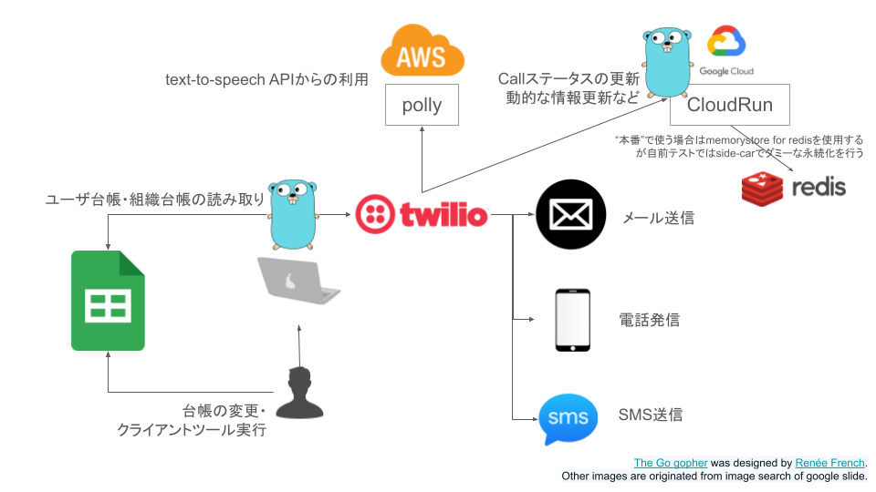
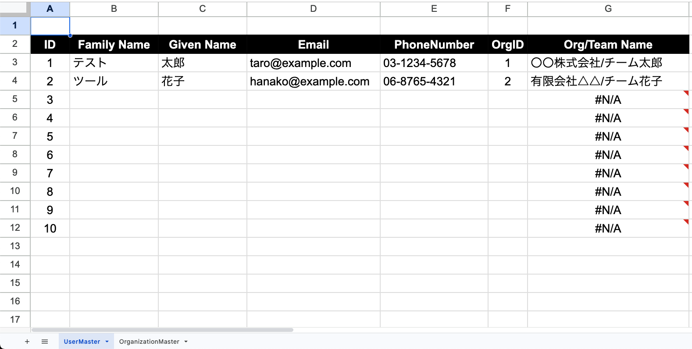
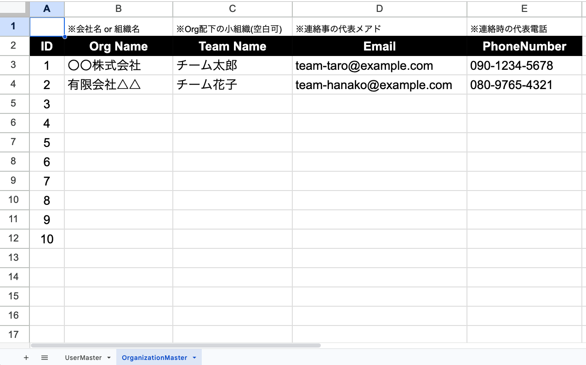

# mock-alert-notifier
Go・クラウドソリューションに対する周辺知識やポートフォリオの棚卸し＆練習のためのリポジトリ  

[](https://github.com/kaz-under-the-bridge/mock-alert-notifier/actions/workflows/go_test.yaml)

## メモ
- 2024/1/上旬時点ではまだWIPです。
  - 進捗は後述のタスクリスト参照
- 以下のようなツールセットやサービスを使う予定
  - Golang
  - Vscode/devcontainer
  - Google Spreadsheet API(Go SDK)
  - Twilio Voice
  - Twilio Sendgrid
  - Twilio SMS
  - Amazon Polly
  - Google CloudRun
    - with Redis side-car Container
  - Terraform
- タスクリスト
  - [x] コード実装 - mockレベル（2024/1上旬）
    - [x] ユーザーまわり
    - [x] メールまわり・テンプレートエンジン
    - [x] 電話発信まわり・コールバックサーバ
    - [x] SMS送信まわり・テンプレートエンジン
  - [x] Twilio APIの単体実装＆テスト（2024/1中旬）
  - [x] AWS/GCPのterraform初期コード (2024/1下旬)
    - [x] GitHub Actions CI/CD化(Go Test)
    - [x] Amazon Pollyを触ってみる
    - [ ] CloudRunデプロイフロー(あとまわし)
  - [ ] クラウドサービスも含めたコード最終化（2024/2上旬）
  - [ ] ブラッシュアップ（2024/2月中〜下旬）

## 運用ツールの概観



- ツール本体は上記のGopherくんのアイコンで稼働
  - PC上で実行されるCLI(クライアント)とCloudRun上で実行されるサーバーの2種類
- クライアントとサーバ実装はプレゼンテーションの実装以外は共通の仕組みにする
  - クライアントは[./cmdのコード](./cmd)を経由して（実装中）
  - サーバーは[./serverのコード](./server)を経由して（未実装）
- ユーザ台帳は次のような形式
  - 
  - G列は次のような数式でOrganizationMasterシートの値を参照（F列のIDでLookup）
  ```
  =INDEX(OrganizationMaster!$B$3:$C$990, MATCH(F3, OrganizationMaster!$A$3:$A$990, 0), 1) & "/" & INDEX(OrganizationMaster!$B$3:$C$990, MATCH(F3, OrganizationMaster!$A$3:$A$990, 0), 2)
  ```
- 組織台帳は次のような形式
  - 
- Q: 永続化や台帳は素直にRDBMSとか使ってサーバ側に寄せれば？
  - A: Spanner/CloudSQLとかAurora/RDSとかが商用利用としては良いが、今回は手軽な永続化でRedisを使う。構造化データはその分Spreadsheetに寄せて扱っている
- Q: 何故Spreadsheet？
  - A: 認証・更新履歴・更新・閲覧権限などがワンセットでできるので割りとこの形式の利用を作者が好んでいるため。あとは今風のクライアント系のスキルセット(JSエコシステム)が壊滅的なので簡単に作れないという理由もある

## 実行前準備

### spreadsheet credentialの取得

あとで書く

## 開発者向け

あとで書く

### devcontainerの起動
- VSCodeのインストール
- [拡張機能](https://marketplace.visualstudio.com/items?itemName=ms-vscode-remote.remote-containers)のインストール
- コマンドパレット（Mac: Command+Shift+P） > `Dev Container: Rebuild Container`

### Goテストの実行
- devcontainer内のターミナルでtask runnerを実行
```
# 再帰的に全てのテストを実行
task test

## 例
root ➜ /workspaces/mock-alert-notifier (main) $ task test
task: [test] which gotest || go get github.com/rakyll/gotest && go install github.com/rakyll/gotest
/go/bin/gotest
task: [test] gotest github.com/kaz-under-the-bridge/mock-alert-notifier/...

# 特定のテストをテスト名を指定して実行
task test-with-run -- <テスト名>

## 例
root ➜ /workspaces/mock-alert-notifier (main) $ task test-with-run -- TestUserRepository_GetUsers
task: [install_gotest] which gotest || go get github.com/rakyll/gotest && go install github.com/rakyll/gotest
/go/bin/gotest
task: [test-with-run] gotest github.com/kaz-under-the-bridge/mock-alert-notifier/... -run TestUserRepository_GetUsers 
```
